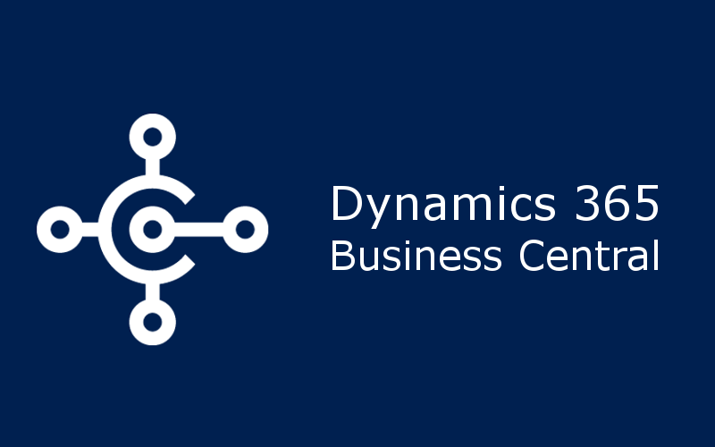


# University in Business Central
The primary goal of this project is to gain a deep understanding of the AL (Application Language) syntax and to practice and apply our knowledge of database entity relationships by modeling a university within Microsoft Dynamics 365 Business Central.  

If you find this repository useful, please consider giving it a ⭐ star. Your support is greatly appreciated!

## About
Learn AL language syntax and apply it to model a university within Microsoft Dynamics 365 Business Central for hands-on practical experience.

## Installing
1. __Prerequisites:__

- Install Visual Studio Code: Download and install Visual Studio Code if you haven't already.
- Install AL Language Extension: Search for "AL Language" in Visual Studio Code extensions and install it.  
 
2. __Set Up Development Environment:__

- You can use either an online sandbox environment or a Docker container as your development environment. For Docker, make sure you have Docker installed and running.   
  
3. __Create a New Project:__

- Open Visual Studio Code and create a new folder for your project.
In the project folder, open the command palette (Ctrl+Shift+P) and use the command AL: Go!. This command initializes a new AL project.  

4. __Define Tables, Pages, and Codeunits:__

- In your project, define tables, pages, and codeunits using AL syntax. These objects represent the data structures, user interfaces, and business logic of your app.  
 
5. __Code Writing and Design:__

- Use Visual Studio Code's AL extension to write your code. You'll get IntelliSense, code formatting, and code analysis to help you write high-quality code.  
  
6. __Test Your App Locally:__

- To test your app locally, you can use the "AL Go!" extension for Visual Studio Code, which deploys your app to a local Docker container. You can test your app's functionality using a web browser.

7. __Publish Your App:__

- Once your app is ready for deployment, you can package it into a .app file. Use the "Publish-NavApp" PowerShell cmdlet to create the app package.
  
8. __Deploy to Business Central:__

- Upload and deploy your app to your target Business Central instance. This can be done using the Business Central administration portal.
  
9. __Manage Your App:__

- After deployment, you can manage your app, install it on various environments, and configure settings as needed.

10. __Debugging and Testing:__

- Use Visual Studio Code's debugging capabilities to test and debug your app, making sure it works as intended.

